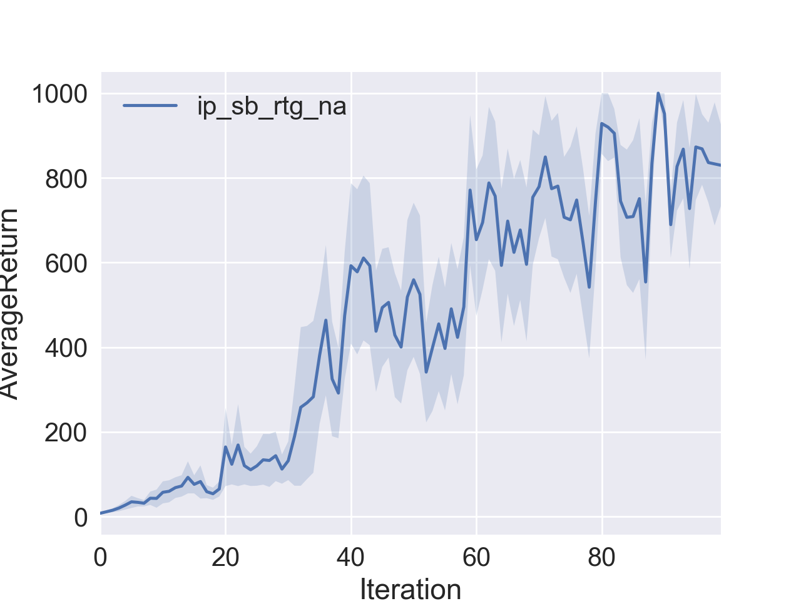

# Report for UCB DeepRL Homework 2, Policy Gradient Deep RL

_Author_     Kay Ke
_Email_      kayke@uw.edu
_Update_    Sep 24, 2017.

## Summary

For this homework, I have completed implementing policy gradient for both discrete and continuous action spaces, implementing reward to go (discount reward by current timestep instead of the begining of the trajectory), implementing advantage normalization, implementing baseline and $\text{GAE-}\lambda$ advantage estimation. I have shown that the algorithm could converge to the optimal score of 200 in CartPole game. I compared the performances for CartPole game using different parameters including network sizes, batches size, turning on/off reward to go and advantage normalization. I have shown that the algorithm could converge to the optimal score of 1000 in the InvertedPendulum game (1D, continuous action space) in 100 iterations, and could achieve an average score > 150 in 100 iterations for HalfCheetah game. 

## Answers

#### Section 4

1. Compare the learning curves for the CartPole small batches (batch size 1000). There are three different settings: vanilla flavor (sb_no_rtg_dna), with reward to go (sb_rtg_dna), with reward to go and advantage normalization (sb_rtg_na). 

   

2. Compare the learning curves for the CartPole large batches (batch size 5000). There are three different settings: vanilla flavor (lb_no_rtg_dna), with reward to go (lb_rtg_dna), with reward to go and advantage normalization (lb_rtg_na). 

   

3. Compare the learning curves for small and large batches. 

   

4. Command lines that generated the images above

   ```Bash
   # Produce experiments results for CartPole
   python train_pg.py CartPole-v0 -n 100 -b 1000 -e 5 -dna --exp_name sb_no_rtg_dna
   python train_pg.py CartPole-v0 -n 100 -b 1000 -e 5 -rtg -dna --exp_name sb_rtg_dna
   python train_pg.py CartPole-v0 -n 100 -b 1000 -e 5 -rtg --exp_name sb_rtg_na
   python train_pg.py CartPole-v0 -n 100 -b 5000 -e 5 -dna --exp_name lb_no_rtg_dna
   python train_pg.py CartPole-v0 -n 100 -b 5000 -e 5 -rtg -dna --exp_name lb_rtg_dna
   python train_pg.py CartPole-v0 -n 100 -b 5000 -e 5 -rtg --exp_name lb_rtg_na
   ```

   ​

5. Answer questions

   - Which gradient estimator has better performance without advantage-centering: the trajectory-centric one, or the one using reward-to-go?

     **From the figures for small / large batches, reward-to-go seems to learn faster from the begining and performs better**. 

   - Did advantage centering help?

     **Didn't help in my set up, with reward to go turned on.**

   - Describe what you expected from the math—do the empirical results match the theory?

     **TODO**

   - Did the batch size make an impact?

     **Yes, the larger batch size results in a smoother learning curve (less variations).  **

6. Display a learning curve for InvertedPendulum-v1

   ```bash
   python train_pg.py InvertedPendulum-v1 -n 100 -b 1000 -e 5 -rtg --exp_name ip_sb_rtg_na --learning_rate 1e-2 --n_layers 2 --size 16
   ```

   

   ​

## Takeaway


## Comments

The code skeleton is laid out nicely with helpful comments. But the instructions in the Homework pdf could be less helpful. Especially the Section 4 because 1) it feels like an extension of lecture and 2) it lists things-to-do in a different order from the code. 